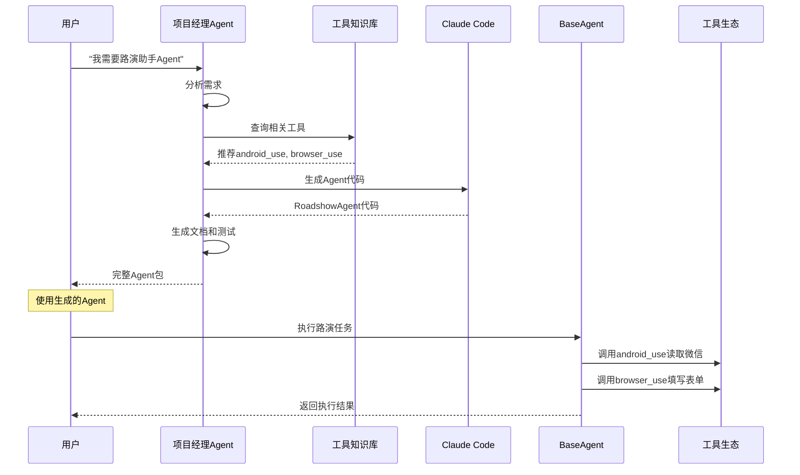

# AgentCrafter 系统架构设计 v2.0

## 整体架构概览

AgentCrafter 是一个自然语言驱动的智能 Agent 构建与运行平台。核心理念是提供**标准化的基础Agent框架**和**智能化的Agent生成系统**，让AI工具（如Claude Code）能够基于完整的接口文档和工具知识库，为用户生成定制化的Agent。

```
┌─────────────────────────────────────────────────────────┐
│                    用户自然语言需求                        │
└─────────────┬───────────────────────────────────────────┘
              │
              ▼
┌─────────────────────────────────────────────────────────┐
│              项目经理Agent (智能开发助手)                  │
│  ┌─────────────┐  ┌─────────────┐  ┌─────────────────┐    │
│  │框架能力分析器│  │工具知识库    │  │Claude Code调用器│    │
│  │(理解BaseAgent)│ │(所有工具能力)│  │(指导AI生成代码) │    │
│  └─────────────┘  └─────────────┘  └─────────────────┘    │
└─────────────┬───────────────────────────────────────────┘
              │ 调用AI工具生成代码
              ▼
┌─────────────────────────────────────────────────────────┐
│                Claude Code 等AI工具                      │
│          基于标准接口和文档生成定制Agent                    │
└─────────────┬───────────────────────────────────────────┘
              │ 继承和扩展
              ▼
┌─────────────────────────────────────────────────────────┐
│                基础Agent框架 (BaseAgent)                  │
│  ┌─────────────┐  ┌─────────────┐  ┌─────────────────┐    │
│  │标准化接口    │  │工具调用接口  │  │扩展接口          │    │
│  │工作流接口    │  │内存管理接口  │  │完整文档和Schema   │    │
│  └─────────────┘  └─────────────┘  └─────────────────┘    │
└─────────────┬───────────────────────────────────────────┘
              │ 调用
              ▼
┌─────────────────────────────────────────────────────────┐
│                    工具生态系统                           │
│     BrowserTool | AndroidTool | MemoryTool | ...        │
└─────────────────────────────────────────────────────────┘
```

## 核心设计理念

### 1. **基础Agent框架优先**
- 提供标准化的 `BaseAgent` 基类
- 定义清晰的接口规范和扩展点
- 为AI工具提供完整的文档和示例

### 2. **工具知识库驱动**
- 每个工具都有完整的能力描述
- 支持智能工具推荐和组合
- 便于AI工具理解和选择

### 3. **AI辅助开发**
- 项目经理Agent作为智能开发助手
- 调用外部AI工具（Claude Code等）生成高质量代码
- 自动化整个Agent开发流程

## 核心组件设计

### 1. BaseAgent 基础框架

所有定制Agent的基础类，提供标准化接口和能力。

```python
class BaseAgent:
    """
    通用Agent基础框架
    所有定制Agent都继承此类，提供标准化接口
    """
    
    # === 标准化接口 ===
    async def execute(self, input_data: Any, **kwargs) -> AgentResult:
        """主执行入口 - 子类必须实现"""
        
    async def initialize(self) -> bool:
        """初始化Agent"""
        
    async def cleanup(self) -> bool:
        """清理资源"""
    
    # === 工具调用接口 ===
    async def use_tool(self, tool_name: str, action: str, params: Dict) -> ToolResult:
        """标准化工具调用接口"""
        
    def register_tool(self, name: str, tool: BaseTool):
        """注册工具"""
    
    # === 内存管理接口 ===
    async def store_memory(self, key: str, value: Any, persistent: bool = False):
        """存储内存"""
        
    async def get_memory(self, key: str) -> Any:
        """获取内存"""
    
    # === 工作流接口 ===
    async def run_workflow(self, steps: List[WorkflowStep]) -> WorkflowResult:
        """执行工作流"""
    
    # === 扩展接口 ===
    def get_capabilities(self) -> Dict[str, Any]:
        """获取Agent能力描述 - 供AI工具理解"""
```

**核心特性：**
- **标准化**：统一的接口规范，便于AI工具理解和扩展
- **可扩展**：预留钩子和扩展点，支持自定义功能
- **文档完整**：每个接口都有详细说明和使用示例
- **工具集成**：无缝集成各种外部工具

### 2. 工具知识库系统

为项目经理Agent提供完整的工具能力信息，支持智能推荐。

```python
class ToolKnowledgeBase:
    """
    工具知识库 - 项目经理Agent用来理解所有可用工具
    """
    
    def register_tool_knowledge(self, tool_knowledge: ToolKnowledge):
        """注册工具知识"""
        
    def find_tools_for_capability(self, capability: str) -> List[ToolKnowledge]:
        """根据能力需求查找工具"""
        
    def analyze_requirements(self, requirements: str) -> ToolRecommendation:
        """分析需求，推荐合适的工具组合"""

class ToolKnowledge(BaseModel):
    """单个工具的知识描述"""
    name: str
    description: str
    capabilities: List[str]  # 工具能力标签
    actions: List[ActionSpec]
    use_cases: List[str]
    integration_guide: str
    example_code: str
```

**核心能力：**
- **智能匹配**：根据需求自动推荐最合适的工具
- **能力索引**：快速查找具备特定能力的工具
- **集成指导**：提供完整的工具集成示例

### 3. 项目经理Agent

智能开发助手，理解框架和工具，指导AI工具生成定制Agent。

```python
class ProjectManagerAgent:
    """
    项目经理Agent - 智能开发助手
    理解基础框架、工具能力，指导AI工具生成定制Agent
    """
    
    async def create_agent(self, user_requirements: str) -> AgentCreationResult:
        """主要工作流程：分析需求 -> 推荐工具 -> 生成Agent"""
        
        # 1. 分析用户需求
        requirements = await self._analyze_requirements(user_requirements)
        
        # 2. 推荐工具组合
        tool_recommendation = self.tool_knowledge_base.analyze_requirements(requirements)
        
        # 3. 生成Agent设计方案
        agent_design = await self._create_agent_design(requirements, tool_recommendation)
        
        # 4. 调用Claude Code生成代码
        generated_code = await self._generate_agent_code(agent_design)
        
        # 5. 生成文档和示例
        documentation = await self._generate_documentation(agent_design, generated_code)
        
        return AgentCreationResult(
            agent_code=generated_code,
            documentation=documentation,
            design=agent_design
        )
```

**工作机制：**
1. **需求理解**：分析用户自然语言需求
2. **工具分析**：基于知识库推荐最佳工具组合
3. **设计生成**：创建完整的Agent设计方案
4. **代码生成**：调用AI工具生成高质量代码
5. **文档生成**：自动创建使用文档和示例

### 4. Agent执行层

负责运行生成的Agent，提供完整的执行环境。

```python
class AgentRuntime:
    """Agent运行时环境"""
    
    class WorkflowEngine:
        """工作流执行引擎"""
        async def execute_workflow(self, steps: List[WorkflowStep]) -> WorkflowResult
        
    class ToolDispatcher:
        """工具调度器"""
        async def call_tool(self, tool_name: str, action: str, params: Dict) -> ToolResult
        
    class MemoryManager:
        """内存管理器"""
        async def store_variable(self, key: str, value: Any) -> None
        async def get_variable(self, key: str) -> Any
        
    class StateManager:
        """状态管理器"""
        async def save_checkpoint(self, state: AgentState) -> None
        async def restore_checkpoint(self, checkpoint_id: str) -> AgentState
```

## 完整工作流程

### 示例：路演助手Agent创建流程



### 生成的Agent示例

```python
class RoadshowAgent(BaseAgent):
    """
    路演助手Agent - 自动处理路演信息提取和表单填写
    由项目经理Agent基于用户需求自动生成
    """
    
    def __init__(self):
        super().__init__()
        # 项目经理Agent推荐的工具组合
        self.register_tool('android', AndroidTool())
        self.register_tool('browser', BrowserTool())
        self.register_tool('extractor', LLMExtractTool())
    
    async def execute(self, customer_name: str, **kwargs) -> AgentResult:
        """
        主执行流程 - 由Claude Code基于BaseAgent接口生成
        """
        # 步骤1: 从微信读取聊天记录
        chat_result = await self.use_tool('android', 'read_chat', {
            'app': '微信',
            'contact': customer_name
        })
        
        # 步骤2: 提取路演信息
        extract_result = await self.use_tool('extractor', 'extract_entities', {
            'text': chat_result.data,
            'entities': ['时间', '项目', '地点']
        })
        
        # 步骤3: 填写企业微信表单
        form_result = await self.use_tool('browser', 'fill_form', {
            'url': 'https://work.weixin.qq.com/roadshow-form',
            'form_data': extract_result.data,
            'submit': True
        })
        
        return AgentResult(
            success=form_result.success,
            data=form_result.data,
            message=f"路演申请已为 {customer_name} 提交完成"
        )
```

## 技术架构

### 后端技术栈
- **核心框架**: Python 3.9+ + FastAPI
- **AI集成**: Claude API, OpenAI API
- **数据存储**: PostgreSQL + Redis
- **容器化**: Docker + Docker Compose
- **监控**: Prometheus + Grafana

### 前端技术栈
- **框架**: React + TypeScript
- **样式**: Tailwind CSS
- **状态管理**: Redux Toolkit

### 目录结构

```
agentcrafter/
├── agent_builder/                  # 需求分析Agent目录 (项目经理Agent系统)
│   ├── knowledge_base/            # 工具知识库
│   ├── claude_integration/        # Claude Code集成
│   ├── requirement_analyzer/      # 需求分析组件
│   └── project_manager_agent.py   # 项目经理Agent
├── base_app/                      # BaseAgent和运行环境
│   ├── core/                      # BaseAgent核心框架
│   │   ├── base_agent.py         # BaseAgent基础框架
│   │   ├── workflow_engine.py    # 工作流引擎
│   │   ├── memory_manager.py     # 内存管理
│   │   └── state_manager.py      # 状态管理
│   ├── tools/                     # 工具系统
│   │   ├── browser_use/          # 浏览器工具
│   │   ├── android_use/          # Android工具
│   │   ├── memory/               # 内存工具
│   │   └── base_tool.py          # 工具基础类
│   ├── memory/                    # 内存管理系统
│   ├── runtime/                   # Agent运行时环境
│   ├── web/                       # 样例web页面和API
│   └── examples/                  # 使用示例
├── schemas/                       # 数据结构定义
│   ├── agent_schema.py           # Agent相关Schema
│   └── tool_schema.py            # 工具相关Schema (待实现)
├── agents/                        # 生成的Agent存储
│   ├── generated/                # AI生成的Agent
│   └── templates/                # Agent模板
├── docker/                        # Docker相关目录
│   ├── base/                     # 基础镜像
│   ├── agent-runner/             # Agent运行环境
│   ├── development/              # 开发环境
│   ├── docker-compose.yml        # 服务编排
│   └── Dockerfile               # 主应用镜像
├── docs/                          # 文档相关目录
│   ├── guides/                   # 开发指南
│   ├── api/                      # API文档
│   └── deployment/               # 部署文档
├── tests/                         # 测试文件
└── config/                        # 配置文件
```

## 核心优势

### 1. **标准化基础**
- 统一的BaseAgent接口，所有Agent遵循相同规范
- 完整的文档和示例，便于AI工具理解和扩展
- 预留扩展点，支持个性化定制

### 2. **智能化构建**
- 项目经理Agent作为超级开发助手
- 自动分析需求，推荐最佳工具组合
- 调用AI工具生成高质量代码

### 3. **工具生态丰富**
- 完整的工具知识库，支持能力匹配
- 插件化架构，新工具可无缝接入
- 标准化工具接口，统一调用方式

### 4. **用户体验优秀**
- 纯自然语言交互，无需编程经验
- 自动生成完整的Agent和文档
- 一键部署和运行

## 安全考虑

1. **执行隔离**: Agent在独立容器中运行
2. **权限控制**: 基于角色的访问控制（RBAC）
3. **数据保护**: 敏感信息加密存储
4. **审计追踪**: 完整的操作日志记录
5. **输入验证**: 严格的参数校验和过滤

## 扩展规划

### Stage 1: 核心框架（当前）
- [x] BaseAgent基础框架
- [x] 工具知识库系统
- [ ] 项目经理Agent
- [ ] Claude Code集成

### Stage 2: 平台化
- [ ] Web管理界面
- [ ] 可视化Agent构建器
- [ ] Agent市场和模板库
- [ ] 多用户协作

### Stage 3: 企业级
- [ ] 企业级权限管理
- [ ] 高可用部署架构
- [ ] 性能监控和优化
- [ ] 第三方系统集成

---

这个新架构的核心是将**基础Agent框架**作为标准化基础，**项目经理Agent**作为智能开发助手，通过**工具知识库**实现智能匹配，最终调用**AI工具**生成高质量的定制Agent。这样既保证了标准化和可扩展性，又实现了完全的自然语言驱动开发。